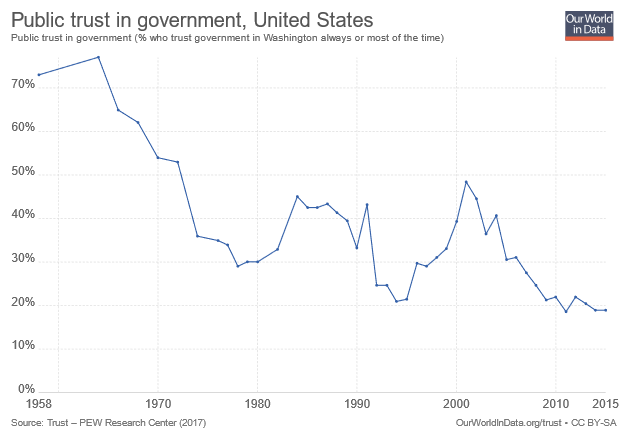
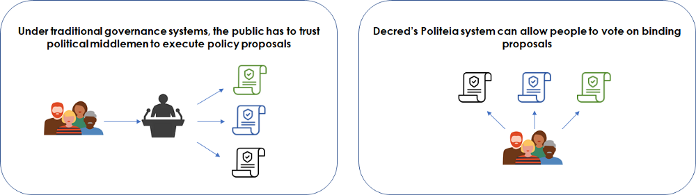

# بناء مستقبل شفاف بسلسلة كتل الديكريد

بقلم Ammarooni

**ملخص**: تغطي هذه الورقة موضوعين رئيسيين: يغطي النصف الأول الاستخدام المحتمل للطابع الزمني لسلسلة الكتل لمحاربة التضليل في صنع السياسة العامة، وكيف يمكن أن يساعد حل منصة بوليتيا لديكريد في تحسين الحوكمة العامة من خلال تمكين الجمهور من التصويت مباشرة على المقترحات المتعلقة بالسياسات، بدلاً من التصويت للسياسيين. فيما يبحث النصف الثاني من هذه الورقة في عدم وجود معايير الإفصاح في مجال أصول العملات الرقمية مثل أيام الغرب المتوحش لفئة الأصول الناشئة، ويلاحظ أن الإفصاحات ستكون شرطًا مسبقًا مع نضج هذه الفئة من الأصول. وتنتهي بتسليط الضوء على الطرق الفريدة التي تميز بها منظمة ديكريد اللامركزية المستقلة نفسها من خلال تعزيز روح الشفافية، والتي ستكون ذات قيمة في السنوات القادمة.

مع دخولنا عقدًا جديدًا، تتراجع الثقة في المؤسسات العامة في جميع أنحاء العالم. فوفقا [لمنظمة Pew للأبحاث](https://www.pewresearch.org/politics/2019/04/11/public-trust-in-government-1958-2019/) فقط 17٪ من الأمريكيين يثقون الآن بحكومتهم "للقيام بما هو صحيح". فعبر تاريخ البشرية، اعتمدنا على "المختارين" - الملوك والكهنة والرؤساء والأنظمة البرلمانية - لتنفيذ قرارات السياسة. وفي حين شهد القرن العشرين ارتفاعا في الديمقراطيات العامة، أصبحنا الآن ندرك أن الديمقراطيات جيدة بقدر استعداد السياسيين للوفاء بوعدهم. وغالبًا ما يقدم السياسيون وعودا كاذبة خلال الحملات، فقط للتراجع عنها فور تنصيبهم.

نحن نعيش في زمن السياسة الاستقطابية، وندخل عصرًا من الخداع العميق حيث سيصبح من الصعب للغاية تمييز الحقيقة من مواقف الحملة المضللة. ويميل السياسيون حاليا إلى استضافة سياساتهم على مواقعهم الإلكترونية، والتي يمكن نسخها أو تعديلها أو حذفها وفقًا لأهواءهم، دون إعلام الجمهور. وعليه فيبدو أنه لا مفر من أننا سنرى الحاجة إلى حلول الطوابع الزمنية التي يمكن أن تكون بمثابة سجلات عامة. فمفهوم ختم الأشياء من أجل الموثوقية ليس جديدًا، حيث تم استخدامه لعدة قرون. يقوم الطابع الزمني الرقمي برقمنة هذه العملية عن طريق ترسيخ مستند أو نص إلى سلسلة كتل غير قابلة للتغيير. فكر في الأمر مثل وجود ختم "أصلي تم التحقق منه" لاقتراح سياسة، والذي يمكن تأكيده من قبل أي شخص.

وكما هو الحال مع معظم التقنيات الجديدة، فمن المرجح أن يبدأ التبني من الدوائر المتخصصة. و المطالبة بإثبات مصداقية مقترحات السياسة العامة تبدو أكثر وضوحًا في البلدان النامية التي تعاني فيها السياسة من الفساد. خلال الانتخابات البرازيلية 2018، [سجل](http://infocoin.net/en/2018/10/17/brazilian-presidential-candidate-registers-his-government-plan-in-decred/) المرشح الرئاسي بالفعل منصة حملته على سلسلة كتل الديكريد. ويمكن أن يوفر هذا نموذجا لمزيد من الشفافية في الحوكمة العامة.

> ففي عصر المعلومات المضللة وانخفاض ثقة الحكومة، تبدو سياسات حملة ختم الوقت رقميًا جاهزة لتناسب المنتج مع السوق.

الديكريد هي مشروع معروف بالعملة الرقمية DCR$، كما تقدم حلول التصويت على [الطوابع الزمنية](https://docs.decred.org/advanced/dcrtime/#dcrtime) و سلسلة الكتل التي يمكن استخدامها لتحسين أنظمة الحوكمة العامة التقليدية لدينا. وفي المستقبل القريب، سيتمكن المسؤولون العموميون النزيهون من استخدام الطابع الزمني للإعلان عن سياساتهم، لإظهار أنهم لا "يتراجعون" عن الوعود. ولكن على الأمد البعيد، فإن نظام بوليتيا لديكريد قادر على فصل السياسات عن الساسة بالكامل.

**صوت للسياسات و ليس للسياسيين:**

يُستَخدم حل التصويت لبوليتيا حاليا للتصويت على مقترحات تمويل النظام الإيكولوجي لديكريد. تتمثل إحدى مزايا هذا الحل في إمكانية تشغيل البرنامج بشكل مستقل عن أي مزودين مركزيين قد يكون لديهم تحيزات. و في المستقبل، يمكن أن يوفر الجمع بين عقود بوليتيا والعقود الذكية القدرة على التصويت على التطبيقات الخارجية في المجال العام، والتي يمكن أن تشمل التصويت على مقترحات السياسة العامة التي يتم تنفيذها في القانون، باستخدام العقود الذكية.

> لا يتعين علينا دائمًا التصويت للسياسيين الذين "لا نختلف مع مواقفهم". سنكون قادرين بالتصويت المباشر على السياسات التي نهتم بها كثيرًا.

بدلاً من التصويت للوسطاء، ستكون وجهات النظر المتنافسة قادرة على تقديم مقترحات مدروسة جيدًا يمكن للجمهور التحقق منها، وإذا وافق عدد كافٍ من الأشخاص ذوي الجلد في اللعبة على فكرة، فيمكن تنفيذها تلقائيًا.

**سيستغرق إصلاح الحوكمة العامة وقتًا، ولكن هناك حالة استخدام أوثق لـبوليتيا تتجاوز النظام البيئي الخاص بـديكريد.**

كمجتمع، لن نقوم بتحويل أنظمة الحوكمة لدينا بين عشية وضحاها. ولكن هناك تطبيق قريب المدى للتصويت بوليتيا، والذي ينطوي على توسيع قدرات التصويت لمشاريع سلاسل الكتل أخرى. والديكريد هي واحدة من أولى سلاسل الكتل التي يمكنها دعم توافق التبادل المباشر مع سلاسل الكتل الأخرى باستخدام [المقايضات الذرية](https://www.investopedia.com/terms/a/atomic-swaps.asp). فالجمع بين الطابع الزمني والتصويت والتوافق عبر السلاسل سيجعل من الممكن تقديم "الاستفتاءَات كخدمة" لشبكات سلاسل الكتل الأخرى. ومن هذا المنظور، يمكن أن تصبح ديكريد موفرة للبنية التحتية للعديد من المجتمعات التي تبحث عن التصويت المجتمعي والشفافية.

**تعد العملات المشفرة محفوفة بالمخاطر في المقام الأول، ولكنها تعاني أيضاً من مشكلة الشفافية وكشف البيانات.**

بعيدًا عن عامل الجذب المتعلق بالغنى السريع عن طريق العملات الرقمية، فإن قدراً كبيراً من وعودها طويلة المدى تكمن في قدرتها على إزاحة السياسة في عمليات صنع القرار في البنك المركزي عن طريق التشغيل الآلي للسياسات النقدية. وسيكون من قصر النظر التفكير في المال كتكنولوجيا، دون النظر في بنيتها الاجتماعية. وعلى الرغم من كل إشارات الفضيلة، لا تزال مجتمعات العملات الرقمية غارقة في عمليات الكشف الانتقائية ونقص الشفافية. والواقع أن العوامل الكلية التي من شأنها أن تفرض تَبَنِّي العملات الرقمية على مدى العقد المقبل تخرج عن نطاق سيطرتها (على سبيل المثال الدورات الاقتصادية العالمية والبيئات التنظيمية). ولكن حتى عملياتها الداخلية لصنع القرار ظلت غارقة في الغموض وانعدام الشفافية، مما أضاف مخاطرة لا لزوم لها إلى المستثمرين الجدد.

نمت شعبية العقد الأول من العملات الرقمية مع المتبنين الأيديولوجيين ( سايبربانك وأسواق الظل) والمتبنين الأوائل للتكنولوجيا، و لكن فئة الأصول بدأت تحظى باهتمام متزايد من المستثمرين المؤسسيين. على الرغم من أنه يمكن للمستثمرين اليوميين الاستثمار على أساس العواطف والأيديولوجية  يجب على المستثمرين المؤسسيين الالتزام بالحرص الواجب حيث يتعين عليهم الرد على المؤتمنين. ويستثمر أكبر مديري الأموال للكثير من الأسباب المختلفة، لكنهم يتوقعون دائمًا الشفافية من أصولهم الخاضعة للإدارة.

> ولكي يتم اعتماد العملات الرقمية من قبل المستثمرين المؤسسيين، فإنها ستحتاج إلى أكثر من استراتيجية "التخزين والأمل". وفي نهاية المطاف، ستتنافس هذه الفئة من الأصول على تخصيص الحافظات المالية مع أصول أخرى. و هناك فرصة لمجتمعات العملات الرقمية للتميز من خلال أخذ زمام المبادرة في الشفافية.

يبلغ إجمالي القيمة السوقية للعملات الرقمية اليوم حوالي 200 مليار دولار، لكل سقف سوق للعملات الرقمية. يبدو هذا رقمًا مرتفعًا بالنسبة للمبتدئين، ولكن لوضع هذا في السياق، فقد سيطرت صناعة إدارة الأصول في أمريكا الشمالية على أكثر من 88.5 تريليون دولار في نهاية عام 2017 ، وفقًا ل McKinsey. كما كتب [Ryan Selkin](https://messari.io/article/transparency-2020) من Messari مؤخرًا، ما لم تتعلم فئة الأصول هذه تقديم الشفافية، فإنها تخاطر بالنزول إلى الظلال.

**تحتاج العملات الرقمية إلى صيغتها الخاصة لمعايير الكشف عن المبادئ المحاسبية المقبولة عمومًا**

يذكرنا مجال أصول العملات الرقمية اليوم إلى حد ما بأيام الغرب الأمريكي في أسواق الأسهم منذ ما يقرب من قرن من الزمان، بحيث افتقرت الشركات المتداولة علنًا إلى مجموعة محددة من المعايير. ولم ينحاز المحاسبون والمنظمون والمستثمرون إلى مجموعة من معايير الإفصاح إلا بعد انهيار سوق الأسهم في عام 1929، وهو ما نعرفه الآن بمبادئ المحاسبة المقبولة عموماً GAAP. وبينما يمكن لشبكات العملات الرقمية استخدام السجلات الخاصة بسلسلة الكتل لإنشاء نظام مالي شفاف، فإن الحوكمة والإدارة المالية لهذه الشبكات لا تقل أهمية عن التكنولوجيا والمعتقدات الأيديولوجية التي تبيعها.

> ""لقد جَعَلْتُ مؤسسة الإيثريوم تبيع 70,000 ETH عند أعلى قيمة لها" — [Vitalik Buterin](https://thenextweb.com/hardfork/2019/12/16/vitalik-buterin-ethereum-foundation-ethere-100m/)

في نهاية عام 2019 ، علمنا أن مؤسسة الإيثريوم باعت 100 مليون دولار من ETH في أعلى قيمة لها من سوق 2018. وفي حين أن هنالك من يعلل أن تصفية أحد الأصول في قمة السوق هو استخدام جيد لإدارة الخزانة، إلا أنني أعتقد أن عدم الكشف عن هذا البيع يمثل تحديات أخلاقية، لأن إغراق قدر كبير من الأصول يشكل دوماً ضغطاً على البيع، وهو ما كان من شأنه أن يتسبب في خسارة العديد من مستثمري التجزئة للأموال.

أعتقد أن هناك فرصة للمشاريع لتمييز نفسها على أساس الشفافية. هذا هو أحد الأسباب العديدة التي جعلتني أنجذب  إلى أخلاقيات المنظمة المستقلة اللامركزية ديكريد.

**الشفافية كسمة من سمات المنظمة المستقلة اللامركزية ديكريد:**

في حين أن معظم مشاريع العملات الرقمية تعتمد على الشركات ذات المسؤولية المحدودة غير المتصلة للحصول على دعم التمويل، فإن المنظمة المستقلة اللامركزية ديكريد تحكمها آلية تمويل ذاتي حيث تعيش خزينتها على سلسلة الكتل، ويمكن مشاهدتها في الوقت الحقيقي. وفيما يلي ثلاث طرق تتميز بها المنظمة المستقلة اللامركزية ديكريد على أساس الشفافية:

**عرض في الوقت الحقيقي للأموال المتاحة:**

على عكس العملات الرقمية الأخرى التي تكشف بشكل انتقائي عن مواردها المالية، يمكن الاطلاع على رصيد [خزينة ديكريد](https://explorer.dcrdata.org/address/Dcur2mcGjmENx4DhNqDctW5wJCVyT3Qeqkx?chart=balance&zoom=ijhhasg0-jzdn8rk0&bin=month) على مدار الساعة طوال أيام الأسبوع. ويتجاوز هذا النوع من الإفصاح حتى الأسواق العامة، حيث تكشف الشركات عن مواردها المالية على أساس الربع السنوي.

**تحديثات التنفيذ المتكررة:**

لن يقوم معظم الأشخاص بالتحقق من مستودعات GitHub، لذلك نحتاج إلى آلية أفضل لرؤية تقدم المجتمع. وتقدم [مجلة ديكريد الشهرية](https://medium.com/decred/journals/home) مثالاً مثيراً للاهتمام على الإفصاح المتكرر، حيث يغطي تحديث شهري الخطوط البارزة لخريطة الطريق، وتحديثات مشاركة المجتمع المحلي، والتقارير المالية المتداولة مدمجة في مجلة واحدة. وما يثير الاهتمام بشكل خاص في هذه المجلة هو كيف أنها تستند إلى مدخلات مفتوحة المصدر، مع مساهمين من جميع أنحاء العالم. وإنه من طبيعة العملات الرقمية أن تستخدم إيداعات جمع البيانات الإلكترونية وتحليلها واسترجاعها التقليدية، والتي ستكون مألوفة لدى المستثمرين المؤسسيين.

**عملية صنع قرار شفافة:**

العملات الرقمية هي أموال قابلة للبرمجة، وستحتاج إلى عمليات إدارة التغيير من أجل الحصول على دعم برامج طويل المدى. وفي هذا الجانب، فإن شفافية حوكمة مجتمع ديكريد هي عامل تمييز عن العملات الرقمية الأخرى.

يعد تصميم ديكريد من نواحٍ عديدة نهجًا متناقضًا مع البتكوين، مع حوكمة المجتمع أكبر مثال على ذلك. وتتمثل فرضية حوكمة البتكوين في أنه من خلال عدم وجود عمليات تغيير محددة جيدًا، يمكن لقاعدة الكود أن تدفع القرارات الرئيسية، مما يؤدي إلى طبقة أساسية غير قابلة للتغيير. وعلى النقيض من ذلك، تقول أخلاقيات ديكريد أن التغيير أمر لا مفر منه، ونحن بحاجة إلى جعل إدارة التغيير شفافة قدر الإمكان، مع وضع حدود عالية لتغييرات الإجماع. كما أن عملية حوكمة البتكوين لا تحدد من سيدفع مقابل مقترحات التحسين، وتترك التغييرات في يد حفنة من المطورين والمعدنين قبل أن يتم تفعيلها. وخلافا لذلك، ففي عملية الحوكمة في ديكريد، تُقترح مقترحات التحسين علناً على منصة بوليتيا، حيث يستطيع مالكي وحدات الديكريد التصويت وتقديم تعليقات عليها.

> تُخرِج البتكوين قرارات صعبة، على أمل أن يكون البرنامج الحالي مفيدًا لما لا نهاية. بينما تعالج الديكريد القرارات الصعبة بشكل مباشر، مع وضع عتبات عالية للاحتفاظ بإجماع المجتمع.

أعتقد أن السماح لأصحاب التوكنات بالإسهام في القرارات المجتمعية لن يؤدي فقط إلى المزيد من القدرة على التكيف على المدى الطويل، بل سيؤدي أيضا إلى جانب متميز من تأثير شبكة ديكريد.

**لا تزال غير مثالية، ولكنها أفضل من آخرين.**

لقد أجريت بعض [التحليلات السابقة](https://ammarooni.medium.com/decred-an-alternative-contender-a3547a014745) لإبراز أن خزينة التمويل الذاتي لديكريد لديها القدرة على النمو لتبلغ قيمتها مليارات الدولارات في يوم من الأيام. ومع نضوج المجتمع، من المنطقي تطوير إفصاحاته المالية بحيث تعكس توزيعا مصنفا للنفقات. ومن المحتمل أن يؤدي هذا إلى جعل إفصاحات ديكريد متماشية مع الأصول الأخرى القابلة للاستثمار والتي تكشف عن نفقات البحث والتطوير والتسويق وغيرها من النفقات.

سننظر إلى العقد الأول من القرن الحادي والعشرين على أنه الأيام البدائية للعملات الرقمية، حيث كانت المعايير نادرة، وكان هنالك الكثير المحتالون. و مع مرور الوقت، ستتعلم الأسواق تقييم المشاريع التي لها سجل حافل من الجودة والاتساق.

تتعدى العملات الرقمية مجرد الثقة في قاعدة الكود مقابل المؤسسات النقدية التقليدية التي يقودها الإنسان. فهي تتمحور حول بناء الثقة في الشبكات الموزعة. وفي النهاية، لن تكون الثقة ممكنة إلا إذا كان لديها أساس من الشفافية للبناء عليه.

**شكر وتقدير:** أود أن أشكر كل من richardred@، و Checkmate@، و Akin Sawyerr و Dustin LeFebvre لكونهم لطفاء بما يكفي لتصحيح الإصدارات السابقة من هذه المقالة.

**إخلاء المسؤولية:** هذه المقالة مخصصة للأغراض الإعلامية، وليس كمشورة استثمارية احترافية.

رابط النص الأصلي: [Building a transparent future with the Decred blockchain](https://medium.com/decred/building-a-transparent-future-with-the-decred-blockchain-e77471d28059)

تمت الترجمة إلى اللغة العربية بواسطة: arij@. قام بالمراجعة و التدقيق abdulrahman4@.

